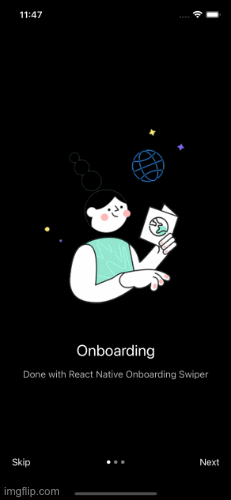
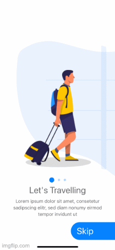
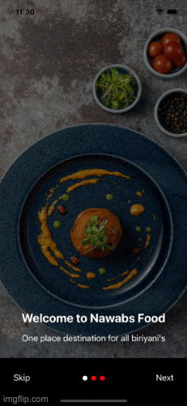

<h2>Hi, I'm Venkat Reddy </h2>

<em>React Native Developer</em>

<h2>About Me:</h2>

I am having overall 3.6 years of experience in writing web apps and Mobile Applicaitions.  Has extensive knowledge of front-end JavaScript and browser APIs as well as significant experience with popular frameworks and libraries like React native, Laravel and Redux. 

<h4> Sample React Native projects: </h4>

#### Firebase Social Connect Application

This the firebase Application with Firebase Authentication, Google Login and Social Login
 
https://github.com/vnrtumu/thumu
 

#### Loan Book

This sample Application to track the loan lended or borrowed
 
https://github.com/vnrtumu/loanbook
 

#### Restaurent Applications

This is a food Delivery appliation for cloud kitchen.
 
https://github.com/vnrtumu/nawabs
 

Apart from these i worked on few other applications like:

#### Huddle Mobile Application

#### Board Pointers Application

#### Meals App

#### Study Table Application

#### Loan Darbar

#### Alberta App
    I worked Few Screens and navigation with user permissions of Alberta App. 

